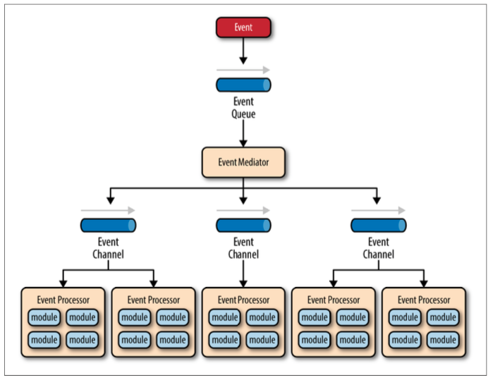
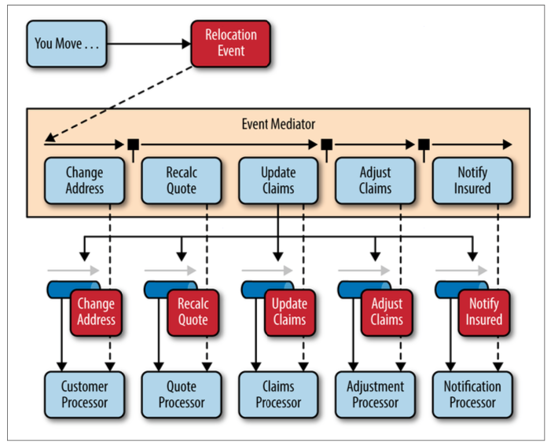
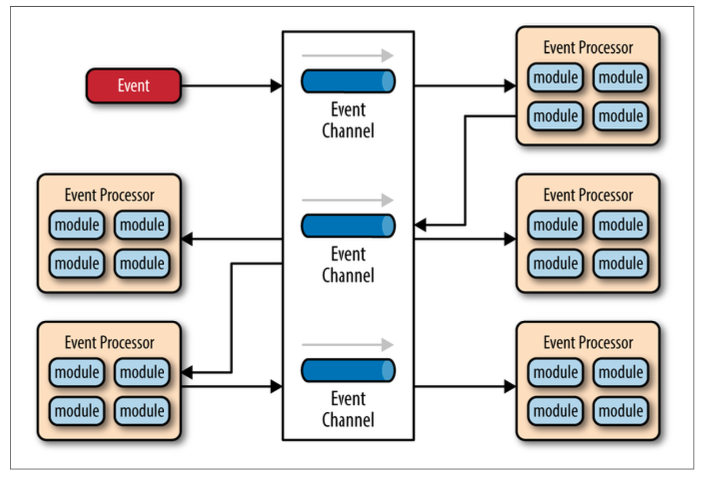
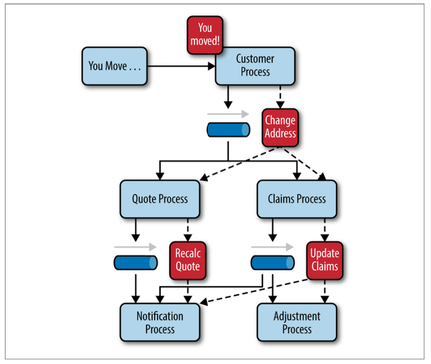

# Software Architecture Pattern 2: Event-Driven

## Objectives

* Understand event-driven architecture pattern
* Apply event architecture pattern to a web application model

## Metrics/Desired Outcomes

* Types of event-driven architecture pattern
* Analysis of patterns
* Implementation of a simple light-weight event system

## Reading Assignment

* Nolen, David. [Clojure Script or How to Run Lisp Everywhere](https://www.youtube.com/watch?v=-I5ldi2aJTI). 
* Nolen, David. [Om Next](https://www.youtube.com/watch?v=ByNs9TG30E8).
* Richards, Mark. [Software Architecture Patterns](http://www.oreilly.com/programming/free/software-architecture-patterns.csp).  Chapter 2: Event-Driven Architecture.

## Event-Driven Architecture Pattern

* Asynchronous and distributed pattern
* Decoupled single-purpose event processor
* Send/receive and process events

### Mediator Topology

* Good for multi-step events requiring orchestration

* Four components working together
  * Event Queues -- as events come in they are placed on a queue and this queue delivers them to the mediator
  * Event Mediator -- receive **initial** events from the queue and orchestrate the event from one channel to the next
  * Event Channels -- manage and control the event processors by generating **processing** events
  * Event Processors -- executes the processign events

* Event Queue can be anything: message queue, web service endpoint, etc.

* Two types of events
  * Initial events
  * Processing events

* Event mediator implementations
  * Opensource integration hubs
  * Business process excution language (BPEL)

### Broker Topology

* Good for simple processing flow
* No centralized mediation
  * Sequence A, Sequence B, Sequence C

* Two architecture components
  * broker -- contains all event channels
  * event processor

* Notice that there are no global queues and there are no initial events

## Considerations

* Complex because of asynchronous
* Distributed computation and coordination
* Failure and recovery consideration
* Maintaining event processor roles and responsibilities
* Standard format

## Pattern Analysis

* Agility
* Ease of Deployment
* Testability
* Performance
* Scalability
* Ease of Development

