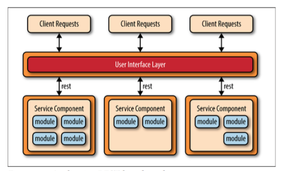
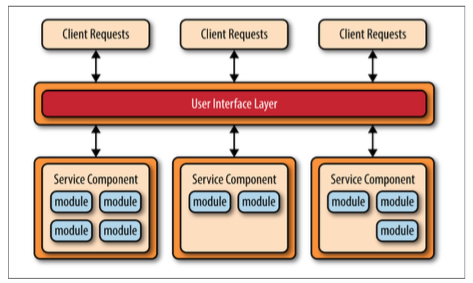
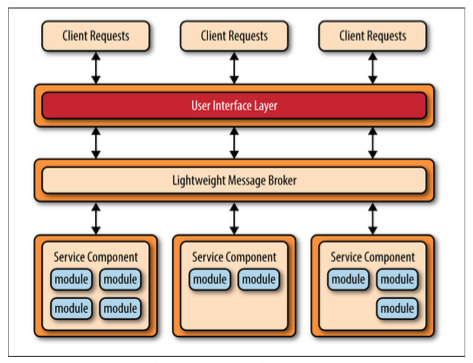

# Software Architecture 4: Microservices

## Objectives

* Understand microservices
* Construct a service server

## Metrics/Desired Outcomes

* build microservice application

## Reading Assignment

* Ford, Neal. [Building Microservice Architecture](http://nealford.com/downloads/Building_Microservice_Architectures_Neal_Ford.pdf).
* Gupta, Arun. [Getting Started with Microservices](pdfs/microservices.pdf). DZONE refcardz collection.

### Microservice

* Working definition 
* HTTP-based service with *small* capability
* Can be "web-less" (but eventually will support web)
* Backend has to be database driven
* Simple API key header for protection

#### Tools and consideration

* RESTful & stateless
* RING infrastructure
* Security in mind
* SPA friendly
* Headless framework

#### Integration consideration

* JSON is the lingua franca
* Marshalling and unmarshalling of JSON objects
* Persistence should be a simple shop from data to db

### Key concepts

* separately deployed units
* service-centric components (with varying granularity)
* distributed architecture
  * Access protocol: JMS, AMQP, REST, SOAP, RMI
* Migration from monolithic footholds
* Perfect for continuous integration and continuous delivery

### Key Topologies

There are many microservices topologies.  These range from complex RMI to simplified REST-ful providers (such as our game example).  We instead focus here on three common descriptors.

#### API REST-based 

* Websites that expose small, self-contained individual services through some sort of API
* Very fine-grained service

#### Application REST-based 

* Client requests are received through traditional web-based or fat-client business application screens rather than through a simple API layer
* These service components tend to be larger, more coarse-grained, and represent a small portion of the overall business application rather than fine-grained, single-action services

#### Centralized Messaging

* Instead of using REST for remote access, this topology uses a lightweight centralized message broker
* The lightweight message broker found in this topology does not perform any orchestration, transfor‐ mation, or complex routing; rather, it is just a lightweight transport to access remote service components
* The benefits of this topology over the simple REST-based topology discussed previously are advanced queuing mechanisms, asynchronous messaging, monitoring, error handling, and better overall load balancing and scalability.

## Key Challanges

* Avoid dependencies
* Avoid over-orchestration

## Biggest gains

* Real-time and continuous deployment without having to restart the system.  
* De-couple services 
* Partition of workload (facilitate with decomposition)

## Pattern Analysis

* Agility
* Ease of Deployment
* Testability
* Performance
* Scalability
* Ease of Development

